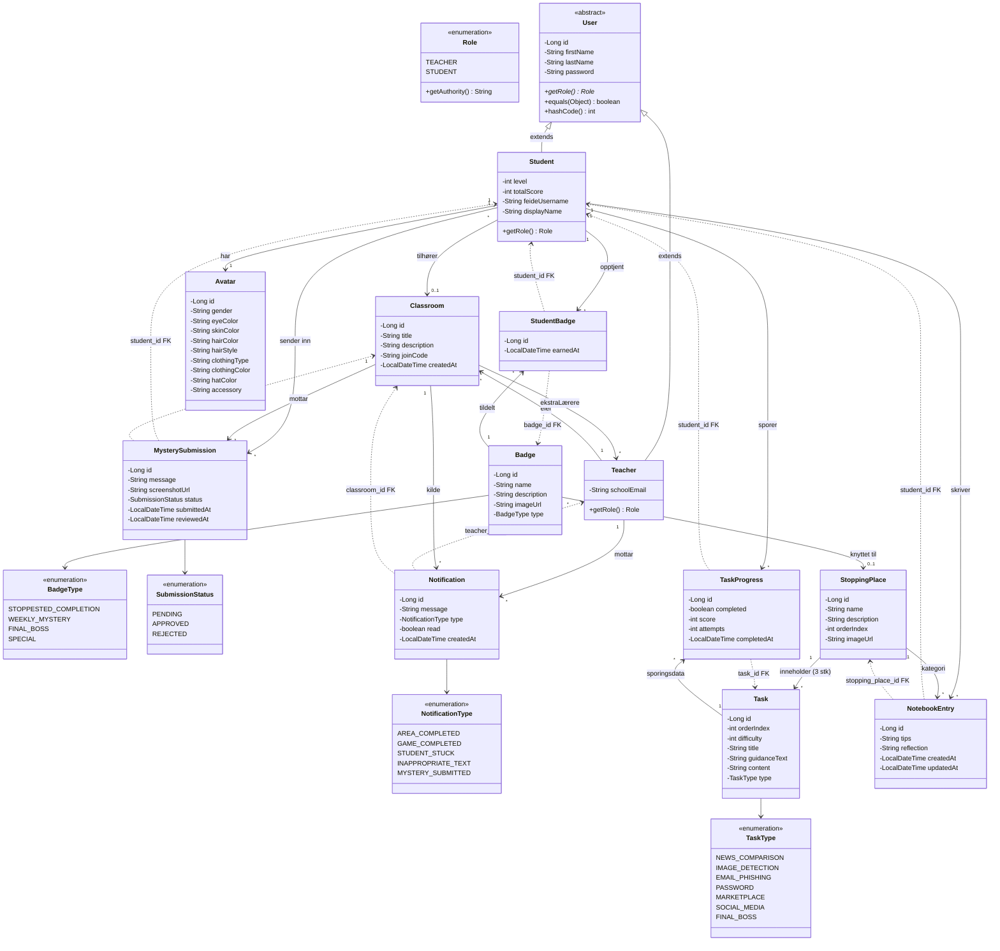

# Klassediagram

Diagrammet viser alle domene-entiteter utledet fra visjonsdokumentet.
Klasser markert med `✅` er implementert. Resten er planlagt.

## Fullstendig domenemodell

---

## Implementeringsstatus

| Klasse | Status | Pakke |
|--------|--------|-------|
| `User` | ✅ Implementert | `features.user.model` |
| `Student` | ✅ Implementert | `features.user.model` |
| `Teacher` | ✅ Implementert | `features.user.model` |
| `Role` | ✅ Implementert | `features.user.model` |
| `Badge` | ✅ Implementert | `features.badge.model` |
| `BadgeType` | ✅ Implementert | `features.badge.model` |
| `StudentBadge` | ✅ Implementert | `features.badge.model` |
| `Classroom` | ❌ Ikke startet | `features.classroom.model` |
| `Avatar` | ❌ Ikke startet | `features.avatar.model` |
| `StoppingPlace` | ❌ Ikke startet | `features.game.model` |
| `Task` | ❌ Ikke startet | `features.game.model` |
| `TaskType` | ❌ Ikke startet | `features.game.model` |
| `TaskProgress` | ❌ Ikke startet | `features.progress.model` |
| `NotebookEntry` | ❌ Ikke startet | `features.notebook.model` |
| `MysterySubmission` | ❌ Ikke startet | `features.mystery.model` |
| `SubmissionStatus` | ❌ Ikke startet | `features.mystery.model` |
| `Notification` | ❌ Ikke startet | `features.notification.model` |
| `NotificationType` | ❌ Ikke startet | `features.notification.model` |

---

## Relasjoner forklart

### Bruker → Klasserom
- En **lærer eier** ett eller flere klasserom (`Teacher 1 → * Classroom`)
- Andre lærere kan **legges til** i et klasserom (`Classroom * → * Teacher` via ekstraLærere)
- En **elev tilhører** maks ett klasserom om gangen (`Student * → 0..1 Classroom`)
- Klasserom har en unik **tilgangskode** som elever skriver inn for å bli med

### Spillinnhold
- Kartet har **7+ stoppesteder** ordnet etter `orderIndex` (Detektivkontor → Datasenteret)
- Hvert stoppested har **3 oppgaver** med stigende vanskelighetsgrad
- `TaskType` styrer hvilken oppgavevisning frontend bruker (velg nyhetsartikkel, vurder bilde, osv.)

### Progresjon
- `TaskProgress` er **koblingstabell mellom Student og Task** — kjernefakta for all progresjon
- Stoppested-fullføring **utledes**: er alle 3 TaskProgress for det stoppestedet `completed = true`?
- Stoppested-opplåsing **utledes**: er forrige stoppested (etter `orderIndex`) fullført?
- `Student.totalScore` caches fra `SUM(TaskProgress.score)` for rask ledertavle-spørring
- `Student.level` oppdateres av servicelaget når stoppesteder fullføres

### Merker (Badges)
- `Badge` er en **definisjon** (finnes én gang uavhengig av antall elever)
- `StudentBadge` er **koblingstabell** med tidsstempel for når merket ble opptjent
- `Badge` har en **valgfri FK til StoppingPlace** — kun satt for `STOPPESTED_COMPLETION`-merker
- Unikt constraint `(student_id, badge_id)` hindrer at en elev får samme merke to ganger

### Notatblokk
- Én `NotebookEntry` per elev per stoppested
- `tips` fylles **automatisk** når eleven fullfører oppgaver (teori/veiledning)
- `reflection` er elevens **egne fritekst-refleksjoner** (visjonsdok s.13–14)
- Lærere kan **lese** elevenes notatblokker (visjonsdok s.20)

### Ukens mysterium
- Elever sender inn eksempler de har funnet (screenshot + melding)
- Læreren **godkjenner eller forkaster** innsendte eksempler
- Godkjente eksempler vises til hele klasserommet
- Godkjenning gir eleven en `WEEKLY_MYSTERY`-badge

### Varslinger
- Lærere mottar varslinger for: fullført stoppested, fullført spill, elev som sitter fast, upassende tekst, nye mysterium-innsendinger
- Filtreres per klasserom
- Kan markeres som lest/fjernes

---

## Stoppesteder fra visjonsdokumentet

| # | Stoppested | Tema | TaskType |
|---|-----------|------|----------|
| 1 | Detektivkontor | Startpunkt / introduksjon | — |
| 2 | Nyhetskvartalet | Falske nyheter, clickbait | `NEWS_COMPARISON` |
| 3 | Fotografen | KI-genererte / manipulerte bilder | `IMAGE_DETECTION` |
| 4 | Postkontoret | Phishing-epost | `EMAIL_PHISHING` |
| 5 | Passordbanken | Sterke passord | `PASSWORD` |
| 6 | Markedsplassen | Falske nettbutikker | `MARKETPLACE` |
| 7 | Den sosiale møteplassen | Deling, gruppepress, kilder | `SOCIAL_MEDIA` |
| 8 | Datasenteret | Final boss — blanding av alt | `FINAL_BOSS` |
